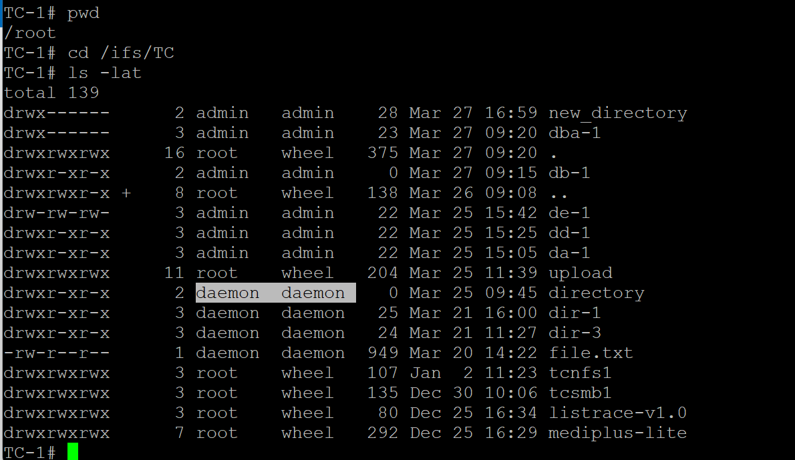

## 注意哦cmd curl 及 curl 方式的 python 是用 http request 的方式去作業的 不是呼叫RAST API

如果是使用http   
HTTP settings>Protocol settings> Document root directory (must be within /ifs) 要去指定目錄 

#檔案內容 , 目錄列表內容 	
`curl -k -u admin:P@ssw0rd    https://192.168.55.51/dir/file-name.txt`

#建一個空檔	
`curl -k -u admin:P@ssw0rd  -X PUT   https://192.168.55.51/upload/b1.txt`
#刪檔	
`curl -k -u admin:P@ssw0rd  -X DELETE https://192.168.55.51/upload/b1.txt`
	
upload  local file and verify	 
`curl -k -u admin:P@ssw0rd -X PUT -d @b2.txt 'https://192.168.55.51/upload/b2.txt`
`curl -k -u admin:P@ssw0rd  https://192.168.55.51/upload/b2.txt`
	
#建空目錄 , 上 傳檔 , 看檔 	
`curl -X MKCOL  https://192.168.55.51/upload/d1 -k -u admin:P@ssw0rd`
`curl -k -u admin:P@ssw0rd -X PUT -d @b2.txt 'https://192.168.55.51/upload/d1/b2.txt`
`curl -k -u admin:P@ssw0rd  'https://192.168.55.51/upload/d1/b2.txt`

備註: readme.md 編輯文檔   code 標記來完全避免 Markdown 解析，這樣就能確保它顯示為普通文字。 所以實際上是沒有  '  ' 指令最前後的反斜線 

上傳或建立的目錄 owner會是  daemon  , 這個結果會是與REST API 鶳建出來的不一樣

